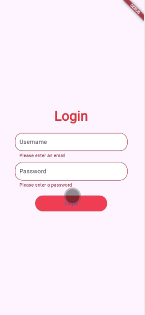

# Form Validation Utils

A lightweight Flutter package providing validation helpers for common inputs like emails, passwords, and phone numbers.

## Features

- **Email Validation**: Check if an email follows the correct format.
- **Password Strength Validation**: Validate password strength based on length, characters, and complexity.
- **Username Validation**: Ensure the username follows specific rules such as allowed characters and minimum length.
- **Phone Number Validation**: Validate phone numbers to ensure they contain only digits and meet length requirements.

## Getting started

To start using `form_validation_utils`, add it to your `pubspec.yaml` file:



For Email Validation
```yaml
                TextFormField(
                  controller: emailController,
                  validator:
                      FormValidators.validateEmail, // validate email input
                  decoration: InputDecoration(
                    hintText: 'Email',
                    filled: true,
                    fillColor: Colors.white,
                    border: OutlineInputBorder(
                      borderRadius: BorderRadius.circular(20),
                    ),
                  ),
                ),
```
For Password Validation
```yaml
                TextFormField(
                  controller: passwordController,
                  validator:
                      FormValidators.validatePassword, // validate password input
                  decoration: InputDecoration(
                    hintText: 'Password',
                    filled: true,
                    fillColor: Colors.white,
                    border: OutlineInputBorder(
                      borderRadius: BorderRadius.circular(20),
                    ),
                  ),
                ),
```
For User Name Validation
```yaml
                TextFormField(
                  controller: userController,
                  validator:
                      FormValidators.validateUsername,// validate User Name input
                  decoration: InputDecoration(
                    hintText: 'User Name',
                    filled: true,
                    fillColor: Colors.white,
                    border: OutlineInputBorder(
                      borderRadius: BorderRadius.circular(20),
                    ),
                  ),
                ),
```
## Next Goals

- **URL Validation**: Validate URLs to check for valid protocols and structure.
- **Date Validation**: Check if a date matches specific formats like `dd/mm/yyyy` or `yyyy-mm-dd`.
- **Credit Card Validation**: Validate credit card numbers using Luhn's algorithm.